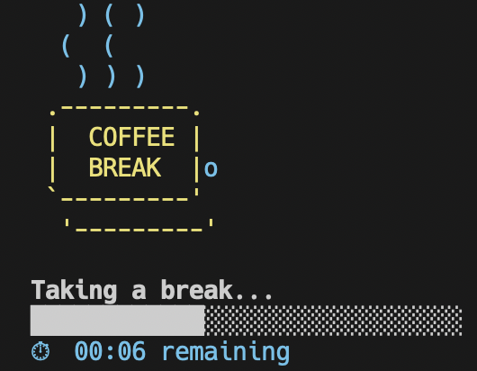

# coffee-break

  

> Coffee break for the AI agent — because even agents need rest!

A Claude Code skill that gives the AI agent a timed coffee break — complete with an animated ASCII coffee cup right in your terminal.

## Installation

### Claude Code

```bash
git clone https://github.com/zondatw/coffee-break ~/.claude/skills/coffee-break
```

### Codex

```bash
git clone https://github.com/zondatw/coffee-break
cd coffee-break && ./setup --host codex
```

### Auto-detect (installs for whichever CLIs are available)

```bash
git clone https://github.com/zondatw/coffee-break
cd coffee-break && ./setup
```

## Usage

```
/coffee-break [duration]
```

**Examples:**

```
/coffee-break          # default: 5 minutes
/coffee-break 10s      # 10 seconds
/coffee-break 2m       # 2 minutes
/coffee-break 30 sec   # 30 seconds
```

The agent parses natural duration formats (`5 minutes`, `2m`, `30s`, `1 min`) and defaults to **5 minutes** if none is given.

## What it does

- Displays an animated ASCII coffee cup with rising steam directly in your terminal
- Shows a live countdown timer and progress bar
- Greets you back when the break is over

The animation renders in Claude Code's own terminal window — no new window or tab is opened.

## How it works

`coffee-break.sh` walks up the process tree from its PID to find the parent terminal's TTY device, then writes ANSI escape codes and animation frames directly to it. This lets the animation appear in Claude Code's terminal even though Claude itself is running as a subprocess.
